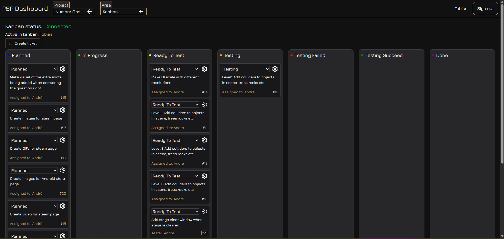
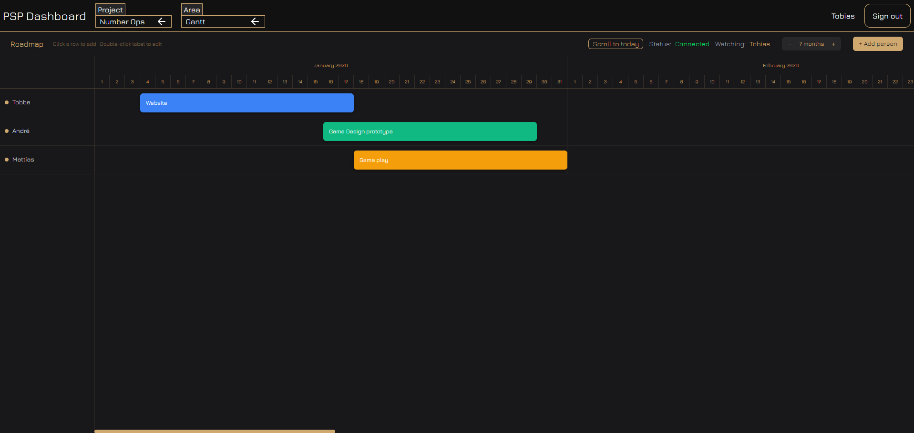
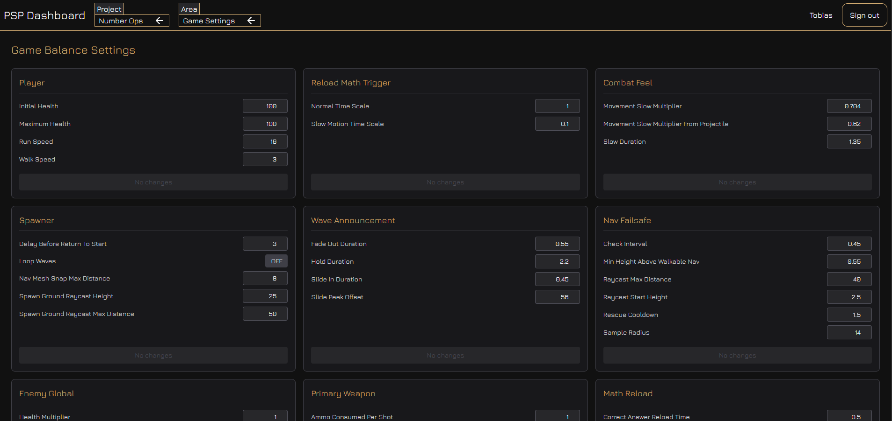

# PSP Dashboard

A project management dashboard for tracking multiple game development projects. Built with React, TypeScript, and Supabase — featuring a Kanban board, interactive Gantt chart, and a live Game Settings editor.

---

## Views

### Kanban
Drag-and-drop ticket management with columns per status. Supports creating, editing, assigning, and deleting tickets per project.



---

### Gantt
An interactive roadmap with drag-to-move, drag-to-resize, and inline label editing. Syncs in real time across users via Supabase Realtime. Supports multiple people per project with per-person task blocks.



---

### Game Settings
A dynamic settings editor driven by rows stored in Supabase. Grouped by section, with per-section dirty-state tracking and a live "Update" button that only activates when values have changed.



---

## Tech Stack

| Layer | Library |
|---|---|
| Framework | React 19 + TypeScript |
| Build | Vite 7 |
| Styling | Tailwind CSS v4 |
| Global state | Zustand |
| Server state | TanStack Query v5 |
| Backend | Supabase (Postgres + Realtime) |
| Forms | React Hook Form + Zod |
| Routing | React Router v7 |
| Notifications | Sonner |

---

## Project Structure

```
src/
├── components/
│   ├── Gant/               # Gantt chart + CSS
│   ├── GameSettings/       # Settings editor, section cards
│   ├── DashboardKanbanPSP/ # Kanban board + context
│   ├── NavigationHeader/   # Top nav with project + view dropdowns
│   └── shared/             # Spinner, dropdowns, etc.
├── hooks/
│   ├── useGantt.ts         # TanStack Query wrapper for Gantt data
│   ├── useGameSettings.ts  # Fetches + groups game setting rows
│   └── useOnlineTracking.ts
├── lib/supabase/
│   └── queriesClient.ts    # All Supabase queries (Kanban, Gantt, Settings)
├── pages/
│   └── DashboardPage/      # Renders the active view
├── zustand/
│   └── store.ts            # currentProjectID + currentView
└── schemas/
    └── schemas.ts          # Zod validation schemas
```

---

## Projects

The dashboard supports three projects, each backed by its own set of Supabase tables:

| ID | Project |
|---|---|
| 1 | Slot Car Racing |
| 2 | Number Ops |
| 3 | Website |

---

## Supabase Tables

Each project gets its own set of tables (replace `{id}` with 1, 2, or 3):

| Table | Description |
|---|---|
| `kanbanPosts_{id}` | Kanban tickets |
| `kanbanColumns_{id}` | Kanban column definitions |
| `ganttPeople_{id}` | Gantt row persons |
| `ganttBlocks_{id}` | Gantt task blocks |
| `gameSettings_{id}` | Key/value settings rows |

### Enable Realtime for Gantt

Run this in the Supabase SQL editor to enable live sync:

```sql
ALTER PUBLICATION supabase_realtime ADD TABLE "ganttPeople_1";
ALTER PUBLICATION supabase_realtime ADD TABLE "ganttPeople_2";
ALTER PUBLICATION supabase_realtime ADD TABLE "ganttPeople_3";
ALTER PUBLICATION supabase_realtime ADD TABLE "ganttBlocks_1";
ALTER PUBLICATION supabase_realtime ADD TABLE "ganttBlocks_2";
ALTER PUBLICATION supabase_realtime ADD TABLE "ganttBlocks_3";
```

---

## Getting Started

### 1. Install dependencies

```bash
npm install
```

### 2. Set up environment variables

Create a `.env.local` file in the project root:

```env
VITE_SUPABASE_URL=your_supabase_project_url
VITE_SUPABASE_ANON_KEY=your_supabase_anon_key
```

### 3. Start the dev server

```bash
npm run dev
```

### 4. Build for production

```bash
npm run build
```

---

## Features

- **Multi-project switching** — dropdown in the nav selects the active project; all views update accordingly
- **Kanban** — create, edit, assign, and move tickets between columns
- **Gantt** — click any row to add a block; drag to move or resize; double-click to rename; delete via toolbar; real-time sync shows "Live" when connected
- **Game Settings** — edit settings per section; Update button only enables when the section is dirty; resets after a successful save
- **Auth** — Supabase email/password login; presence tracking shows who is watching the Gantt board
